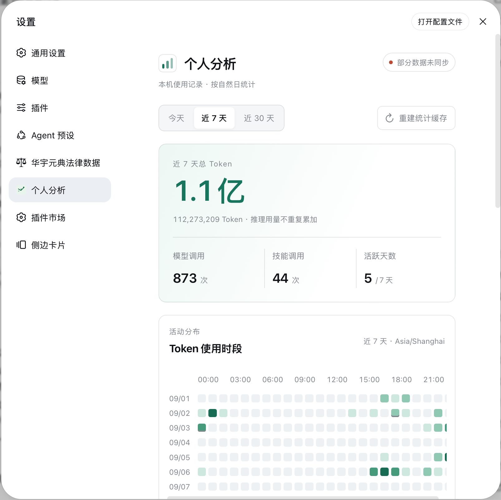
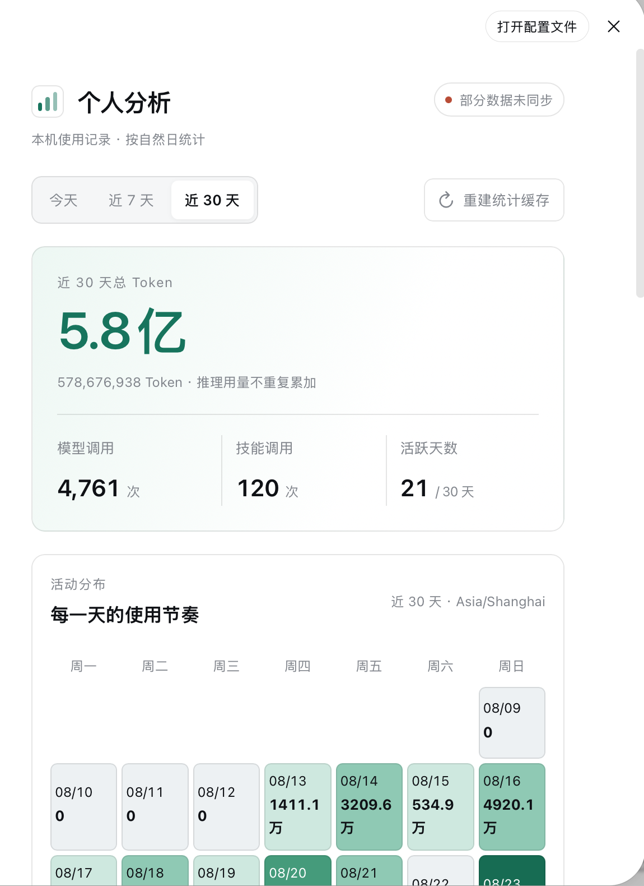
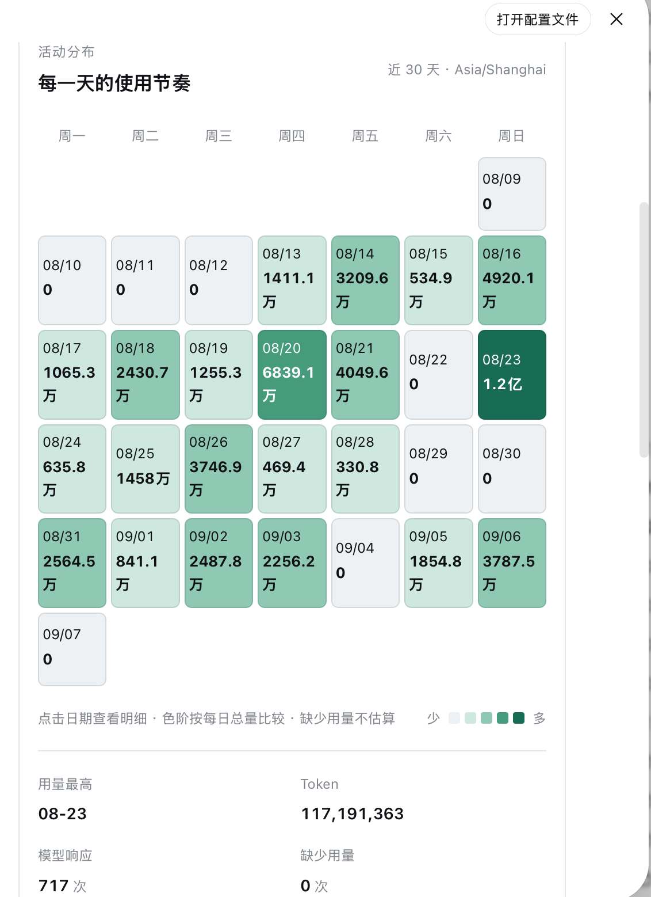

# dsh-usage-analytics

DeepSeek Harness 的本机个人分析插件：在「设置 → 个人分析」展示 1 天、7 天、30 天 Token 热力图、Token 分类、模型分布和技能调用状态。

`0.2.0` 版本重点重构了核心架构与前端，提升统计同步可靠性、页面可读性和异常状态反馈。

## 截图

**设置 → 个人分析总览（近 7 天）**：总 Token、模型 / 技能调用、活跃天数，以及按小时的 Token 使用时段热力图。



**近 30 天视图**：切换统计窗口后展示 30 天总 Token 与「每一天的使用节奏」日历。



**按日明细**：点击日历中的日期查看当天用量明细；色阶按每日总量比较，缺少用量不估算。



## 功能

- 设置页新增「个人分析」分区，按 1 / 7 / 30 天切换统计窗口；
- 今日小时柱图、7 天小时热力图、30 天可点击日历；日期和小时明细按本机时区归类；
- Token 构成条与分类占比，推理用量作为输出子集单独说明；
- 模型分布：显示提供方、调用次数、Token 与用量占比，支持展开完整列表；
- 技能调用：区分自动 / 显式来源，显示成功、失败、未完成数量及成功率；
- 「重建统计缓存」只删除本插件的派生索引，再从原始 DSH 会话重新归集。

## 数据边界

插件只写入自己的派生索引（时间戳、数值型 Token 用量、模型标识、技能名、调用来源和结果）。不写入提示词、模型回复、工具参数、工具结果、工作目录或密钥。Token 与技能明细按 90 天窗口清理（启动时及运行期间每分钟执行）；会话修订号等同步元数据会保留到源会话删除；「重建统计缓存」只删除该派生索引，然后从原始 DSH 会话重新归集，绝不删除会话。

## 依赖

- DSH web profile；
- 目标运行时为 `@deepseek-ai/dsh@0.1.1-rc.2` 的 Web 平台。

## 安装

前置：Node ≥ 20，`dsh web` 可正常运行。

### 安装已有发布版

从 [GitHub Releases](https://github.com/3361805598-gif/dsh-usage-analytics/releases) 下载对应版本的 `.tgz` 安装包（每个 Release 说明中都附有该包的 SHA-256 校验值）：

```sh
curl -L -o dsh-usage-analytics-0.2.1.tgz \
  https://github.com/3361805598-gif/dsh-usage-analytics/releases/download/v0.2.1/dsh-usage-analytics-0.2.1.tgz
shasum -a 256 dsh-usage-analytics-0.2.1.tgz    # 与 Release 说明中的 SHA-256 比对

mkdir -p ~/.dsh/profiles/web/vendor
cp dsh-usage-analytics-0.2.1.tgz ~/.dsh/profiles/web/vendor/
dsh plugin --profile web add file:vendor/dsh-usage-analytics-0.2.1.tgz
```

安装后重启 `dsh web`，再硬刷新浏览器。

### 从源码打包

```sh
npm install
npm run check
npm run pack         # 自动检查、构建，然后产出 dist/dsh-usage-analytics-<version>.tgz

cp dist/dsh-usage-analytics-<version>.tgz ~/.dsh/profiles/web/vendor/
dsh plugin --profile web add file:vendor/dsh-usage-analytics-<version>.tgz
```

安装后重启 `dsh web`，再硬刷新浏览器。

## 更新

改完代码后：`npm run pack` → 把 tgz 放入 `~/.dsh/profiles/web/vendor/`（逐版本留档、不覆盖旧包）→ 重新执行 `dsh plugin --profile web add file:vendor/...` → 重启 `dsh web` + 硬刷新。

## 开发与测试

```sh
npm install
npm run check        # typecheck + vitest + build
```

### 本地界面预览

```sh
npm run preview:ui
# 浏览器打开 http://127.0.0.1:4179
```

预览使用明确标注的模拟数据，不连接 DSH 会话或统计 API。可切换深浅主题、正常/空数据/加载中/错误/索引中状态；日期、图表详情及明细展开均可交互。改动后重跑命令并刷新页面；也可用 `npm run preview:ui -- --build` 更新已运行预览的文件。

前端职责拆分：

- `UsageInsightsPage.tsx`：宿主入口与页面布局；`UsageInsightsView` 为不发请求的展示层。
- `useUsageInsights.ts`：请求取消、轮询、重试与重建生命周期。
- `components/`：活动图表、Token 构成、模型/技能明细。
- `format.ts`：数字、比例、时间标签与色阶；`styles.ts`：局部样式和宿主主题适配。

安装到 DSH 时使用包根目录的 `cordis.patch.yml`；客户端包入口为 `dsh-usage-analytics/client`。

## 缓存同步

- 启动时按会话修订号补齐缓存；每分钟校准源会话删除、外部变更与失败重试，并清理过期明细。
- 每轮结束先 flush 原始会话，再读取落盘事件生成统计；重建、实时更新与后台校准串行执行。
- 统计解析规则带独立版本号，升级后自动重新计算旧规则缓存，无需手动重建。
- `npm run pack` 和 `npm pack` 均通过 `prepack` 自动执行类型检查、测试与构建，避免打包旧产物。

## 统计口径

- `input + output + cache read + cache write` 是总 Token；`reasoning` 是输出子集，只展示、不重复累加。
- 有 DSH `TokenUsage` 的响应为「已知」；缺少用量不估算，计入覆盖率的「缺少用量」。
- fork / subagent 会跳过 `seedLength` 指明的继承事件，避免父会话重复计算。
- 自动技能依据 `skill` 工具的调用/结果配对；用户显式技能调用单列为「显式」。

## 说明与限制

- 仅 Web 平台。样式跟随 DSH Appearance（Light / Dark / System），读取官方 `--dsw-alias-*` token。
- API 受本机同源 trust-fence 保护；`POST /rebuild` 在 fence 之外没有额外鉴权。
- UI 为全中文，无 i18n 层（个人插件定位）。

## 卸载

```sh
dsh plugin --profile web remove dsh-usage-analytics
```

然后重启 `dsh web`。
